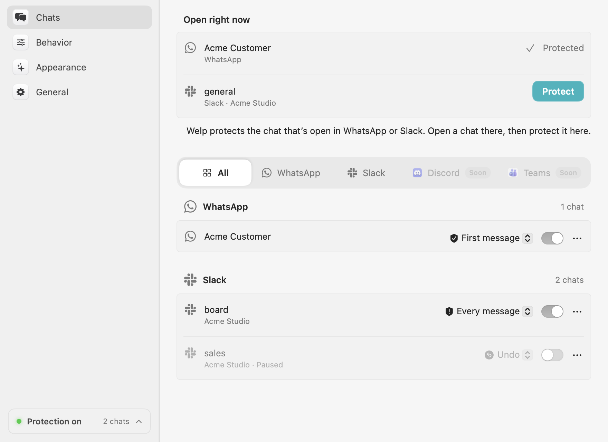
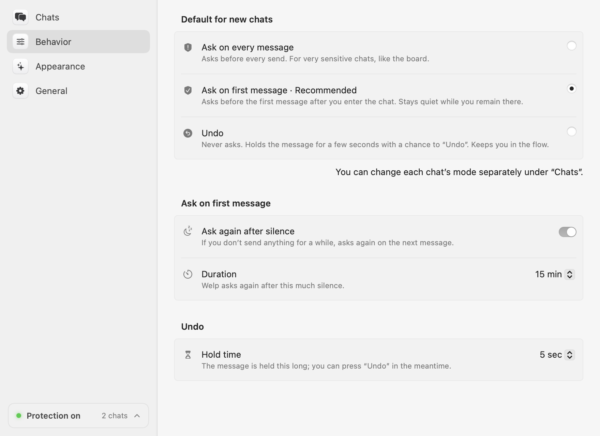
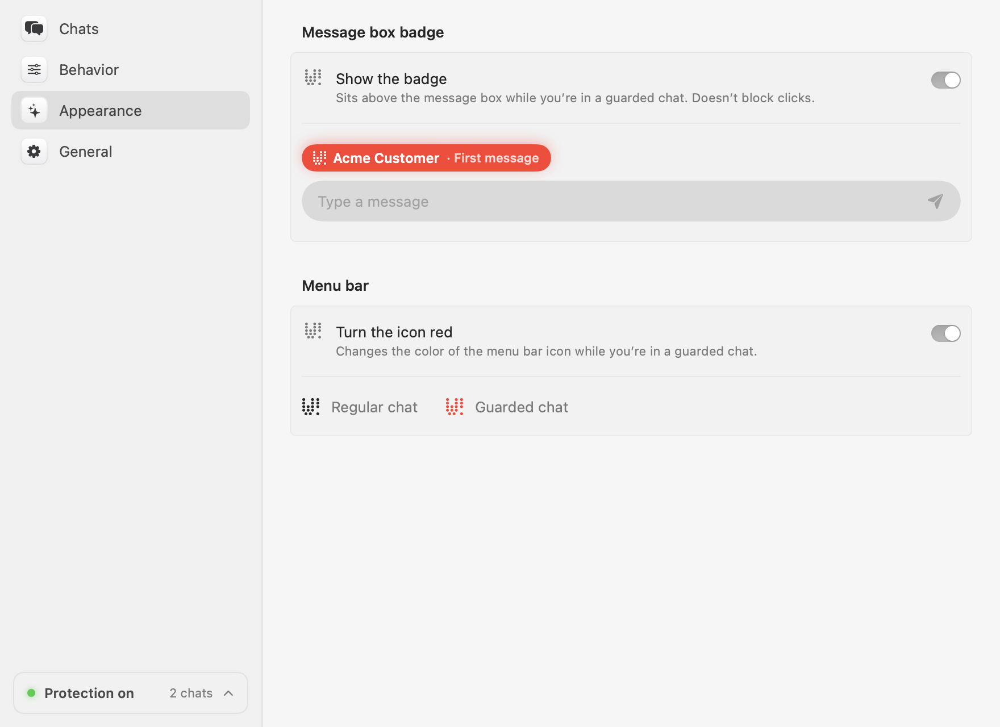

  

<h1 align="center">Welp</h1>

  <strong>Never send a message to the wrong chat again.</strong> 
  A macOS menu bar app that asks <em>“Are you sure?”</em> before you send a message to the
  chats you choose.

  
  
  

<a href="https://www.getwelp.io">getwelp.io</a> · <a href="README.tr.md">Türkçe</a>

<picture>
  <source media="(prefers-color-scheme: dark)" srcset="docs/images/chats-dark.png">
  
</picture>

You meant to send that joke to your friend. It went to the customer group. Welp sits
between your keyboard and the official WhatsApp and Slack apps, and stops that one message
before it leaves your Mac.

- **Works with the apps you already use**: the official WhatsApp and Slack desktop apps.
- **A protection mode per chat**: ask before every message, only before the first one, or
  hold it a few seconds with Undo.
- **Always know where you are**: a badge above the message box and a red menu bar shield
  in guarded chats.
- **Private**: everything runs on your Mac; what you write is never stored or sent.
- **Free for WhatsApp**, in any number of chats. [Welp Pro](https://www.getwelp.io/pro)
  adds Slack, with Microsoft Teams and more to come.

## Install

[Download Welp](https://www.getwelp.io/download) (macOS 14 or later), move it to
Applications and open it. When asked, allow Welp under **System Settings → Privacy &
Security → Accessibility**. Welp keeps itself up to date.

To build it yourself, see [CONTRIBUTING.md](CONTRIBUTING.md).

## Usage

Open a chat in WhatsApp or Slack, then click **Protect** in Welp's settings (menu bar
shield → **Settings…**) or in the menu bar menu. Each guarded chat has a mode:

| Mode | What happens |
| --- | --- |
| **First message** *(default)* | Asks before the first message after you open the chat, then stays quiet while you're there. |
| **Every message** | Asks before every message. For very sensitive chats. |
| **Undo** | Never asks. Holds the message for a few seconds with an Undo notice. |

  
  

In the *Are you sure?* dialog **Cancel** is the default, so a reflexive `Return` never
sends; use **Send** or `⌘↩`. Welp is in English and Turkish and follows your Mac's
language.

## Welp and Welp Pro

Welp is open core: one app, whose core is open source and free, and whose Pro features are
source-available.

| | Welp | Welp Pro |
| --- | --- | --- |
| WhatsApp, any number of chats, every mode | ✓ | ✓ |
| Slack, with Microsoft Teams and more to come | | ✓ |
| Price | Free | [$9.99 a year](https://www.getwelp.io/pro) |
| Code | MIT, outside [`ee/`](ee/) | [`ee/`](ee/), [Welp Commercial License](ee/LICENSE) |

Welp Pro is unlocked with a license key that stays the same for your whole subscription
and works on all your Macs. Cancel any time; Pro keeps working until the end of the year
you paid for. Lost your key? Get it again at [getwelp.io/pro](https://www.getwelp.io/pro#recover).

## Privacy

- Welp reads the message box **only at the moment you send**, to protect that message.
  Message contents are never stored, logged or sent anywhere.
- It doesn't modify WhatsApp or Slack; it reads their interface through the macOS
  Accessibility API, like VoiceOver.
- The official app goes online for two things only: checking
  [getwelp.io](https://www.getwelp.io) for updates, which it asks about first and you can
  turn off, and, with Welp Pro, sending your license key (and nothing else) to getwelp.io
  about once a week to check that your subscription is active. Builds of the open-source
  core never go online.

## Contributing

Bug reports and pull requests are welcome; see [CONTRIBUTING.md](CONTRIBUTING.md) and the
[architecture overview](docs/ARCHITECTURE.md). Report vulnerabilities privately, as
described in [SECURITY.md](SECURITY.md).

## License

This repository is available under the [MIT license](LICENSE), except for the
[`ee/`](ee/) directory (Welp Pro), which has [its own license](ee/LICENSE).

WhatsApp is a trademark of WhatsApp LLC and Slack of Slack Technologies, LLC. Welp is not
affiliated with either.
