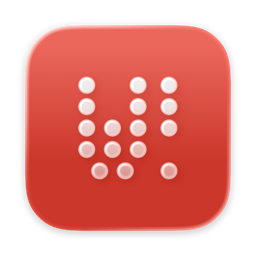
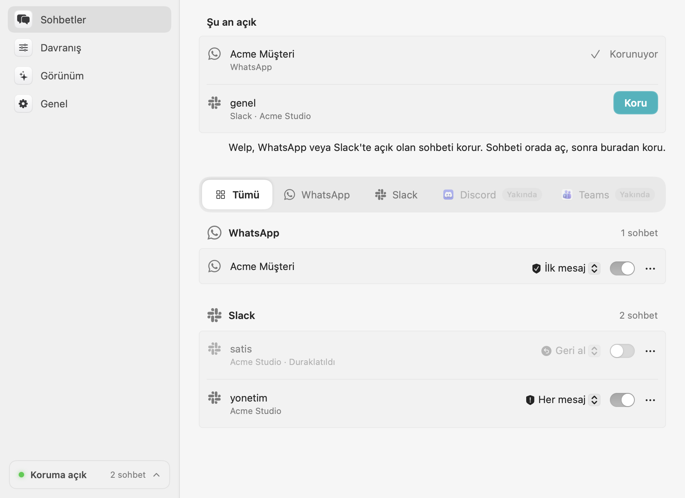
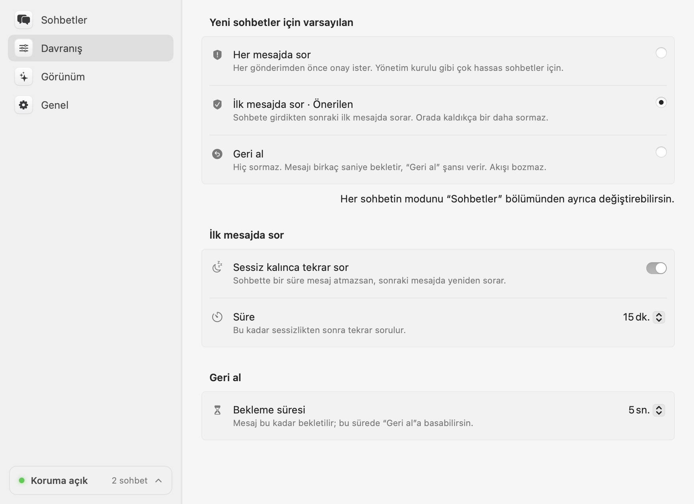
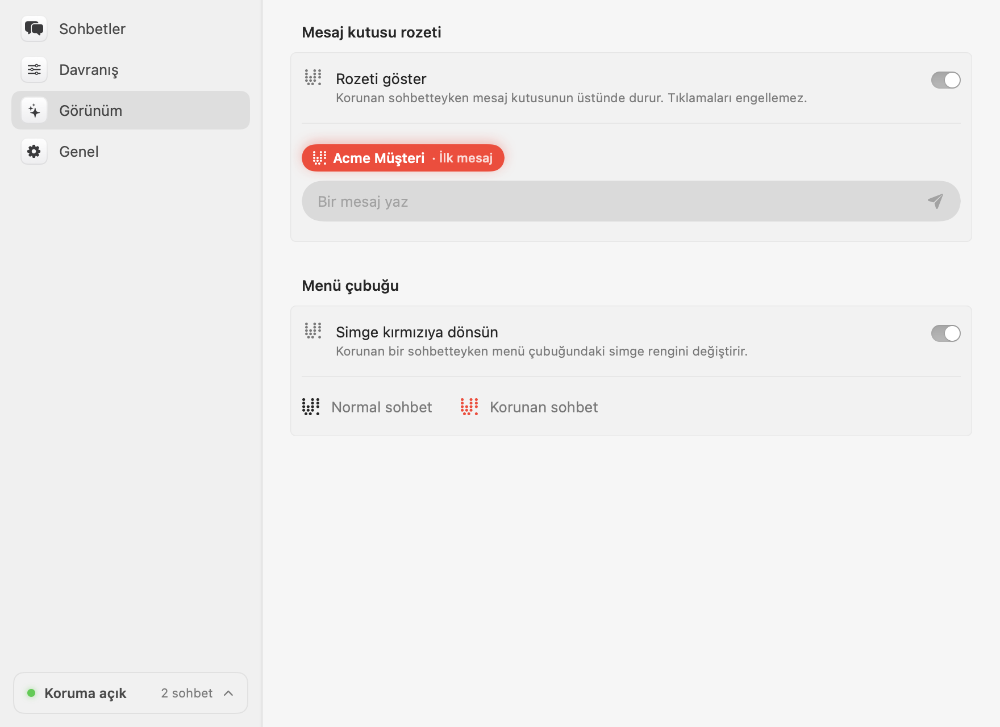

  

<h1 align="center">Welp</h1>

  <strong>Patronunun bunu görmesine gerek yoktu.</strong> 
  Welp, yanlış sohbete göndermeden önce seni durdurur.

<a href="https://www.getwelp.io">getwelp.io</a> · <a href="README.md">English</a>

<picture>
  <source media="(prefers-color-scheme: dark)" srcset="docs/images/tr/chats-dark.png">
  
</picture>

Arkadaşına atacağın şaka müşteri grubuna gitti. Welp, klavyen ile resmi WhatsApp ve Slack
uygulamaları arasında durur ve o tek mesajı Mac'inden çıkmadan yakalar.

- **Zaten kullandığın uygulamalarla çalışır**: resmi WhatsApp ve Slack masaüstü uygulamaları.
- **Her sohbete ayrı koruma modu**: her mesajda sor, yalnızca ilk mesajda sor ya da mesajı
  birkaç saniye "Geri al" ile beklet.
- **Nerede olduğunu hep bilirsin**: korunan sohbetlerde mesaj kutusunun üstünde bir rozet ve
  menü çubuğunda kırmızı bir kalkan.
- **Gizli**: her şey Mac'inde çalışır; yazdıkların hiçbir yerde saklanmaz, hiçbir yere
  gönderilmez.
- **WhatsApp için ücretsiz**, istediğin kadar sohbette. [Welp Pro](https://www.getwelp.io/pro)
  Slack'i ekler; Microsoft Teams ve daha fazlası yolda.

## Kurulum

[Welp'i indir](https://www.getwelp.io/download) (macOS 14 veya üstü), Uygulamalar'a taşı ve
aç. Sorulduğunda **Sistem Ayarları → Gizlilik ve Güvenlik → Erişilebilirlik** altında Welp'e
izin ver. Welp kendini güncel tutar.

Kendin derlemek için [CONTRIBUTING.md](CONTRIBUTING.md) dosyasına bak.

## Kullanım

WhatsApp ya da Slack'te bir sohbet aç, sonra Welp'in ayarlarında (menü çubuğundaki kalkan →
**Ayarlar…**) ya da menü çubuğu menüsünde **Koru**'ya tıkla. Her korunan sohbetin bir modu
var:

| Mod | Ne olur? |
| --- | --- |
| **İlk mesaj** *(varsayılan)* | Sohbeti açtıktan sonraki ilk mesajdan önce sorar, orada kaldıkça bir daha sormaz. |
| **Her mesaj** | Her mesajdan önce sorar. Çok hassas sohbetler için. |
| **Geri al** | Sormaz. Mesajı birkaç saniye "Geri al" bildirimiyle bekletir. |

  
  

*Emin misin?* penceresinde varsayılan düğme **Vazgeç**'tir, refleksle Enter'a basarsan mesaj
gitmez; göndermek için **Gönder** ya da `⌘↩`. Welp Türkçe ve İngilizcedir ve Mac'inin dilini
izler.

## Welp ve Welp Pro

Welp open core'dur: tek bir uygulama; çekirdeği açık kaynak ve ücretsiz, Pro özelliklerinin
kaynak kodu da herkese açık.

| | Welp | Welp Pro |
| --- | --- | --- |
| WhatsApp, istediğin kadar sohbet, tüm modlar | ✓ | ✓ |
| Slack; Microsoft Teams ve daha fazlası yolda | | ✓ |
| Fiyat | Ücretsiz | [Yıllık 9.99 $](https://www.getwelp.io/pro) |
| Kod | MIT, [`ee/`](ee/) dışı | [`ee/`](ee/), [Welp Ticari Lisansı](ee/LICENSE) |

Welp Pro bir lisans anahtarıyla açılır; anahtar abonelik boyunca aynı kalır ve tüm
Mac'lerinde çalışır. İstediğin zaman iptal edebilirsin; Pro, ödediğin yılın sonuna kadar
çalışır. Anahtarını mı kaybettin? [getwelp.io/pro](https://www.getwelp.io/pro#recover)
adresinden tekrar al.

## Gizlilik

- Welp mesaj kutusunu **yalnızca gönderim anında**, o mesajı korumak için okur. Mesaj
  içerikleri hiçbir zaman saklanmaz, kaydedilmez ya da bir yere gönderilmez.
- WhatsApp ya da Slack'i değiştirmez; arayüzlerini VoiceOver gibi macOS Erişilebilirlik
  API'siyle okur.
- Resmi uygulama yalnızca iki şey için internete çıkar: güncellemeler için
  [getwelp.io](https://www.getwelp.io)'ya bakmak (bunu önce sorar ve kapatabilirsin) ve
  Welp Pro'da, aboneliğinin aktif olduğunu doğrulamak için haftada bir lisans anahtarını
  (başka hiçbir şeyi değil) getwelp.io'ya göndermek. Açık kaynak çekirdeğin derlemeleri
  hiç internete çıkmaz.

## Katkı

Hata bildirimleri ve pull request'ler memnuniyetle karşılanır; [CONTRIBUTING.md](CONTRIBUTING.md)
ve [mimari özet](docs/ARCHITECTURE.md) dosyalarına bak. Güvenlik açıklarını
[SECURITY.md](SECURITY.md)'de anlatıldığı gibi gizli olarak bildir.

## Lisans

Bu repo [MIT lisansıyla](LICENSE) sunulur; tek istisna, [kendi lisansı](ee/LICENSE) olan
[`ee/`](ee/) dizinidir (Welp Pro).

WhatsApp, WhatsApp LLC'nin; Slack, Slack Technologies, LLC'nin ticari markasıdır. Welp bu
şirketlerle bağlantılı değildir.
